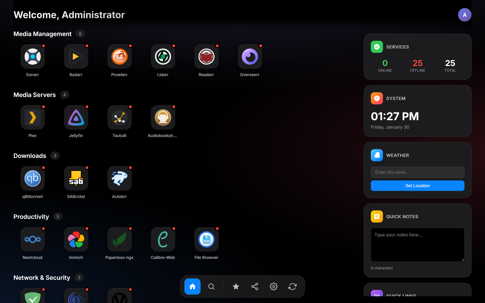
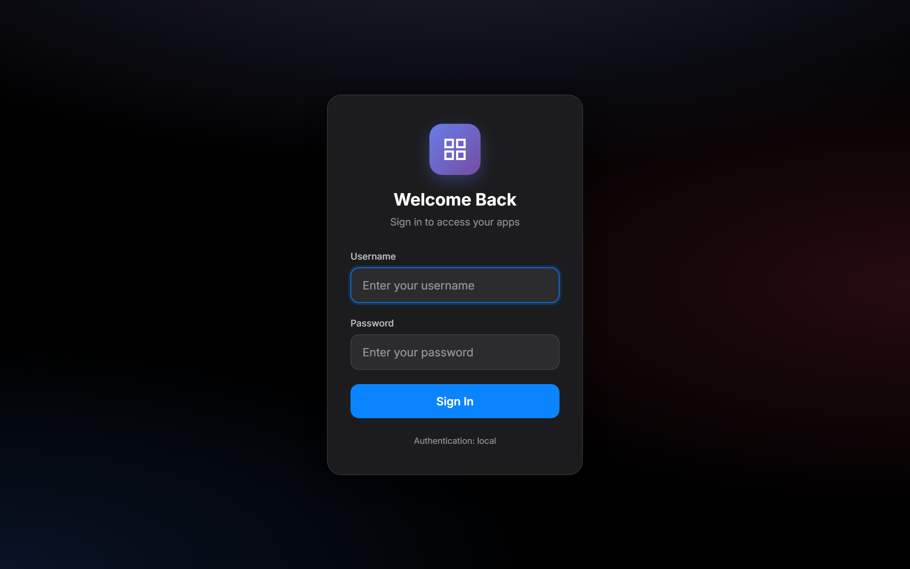

# DashGate

A self-hosted application gateway for managing and accessing your web services. Features multi-method authentication, group-based access control, automatic app discovery from Docker/Traefik/Nginx/NPM/Caddy, and real-time health monitoring.





## Features

- **Multi-method authentication** - Local accounts, LDAP, OIDC/OAuth2, and reverse proxy (Authelia/Authentik) support
- **Group-based access control** - Show apps only to users in specific groups
- **Automatic app discovery** - Discover apps from Docker, Traefik, Nginx, Nginx Proxy Manager, and Caddy
- **Health monitoring** - Background health checks with real-time status indicators
- **First-time setup wizard** - Guided configuration on initial deployment
- **Admin panel** - Manage users, apps, categories, and discovery sources from the UI
- **LLDAP integration** - Manage users and groups via LLDAP directory
- **API key authentication** - Programmatic access with scoped API keys
- **Progressive Web App** - Install as a PWA with offline support
- **Encryption at rest** - Sensitive configuration values (passwords, secrets) encrypted with AES-256-GCM
- **Audit logging** - Track admin actions with audit trail
- **Backup/Restore** - Export and import DashGate configuration
- **Customizable themes** - User-selectable accent colors and dark/light mode
- **Security hardened** - CSP nonce, CSRF protection, rate limiting, HSTS, security headers

## Quick Start

### Docker (Recommended)

```bash
# Create config directory
mkdir -p config

# Run with docker
docker run -d \
  --name dashgate \
  -p 1738:1738 \
  -v ./config:/config \
  --restart unless-stopped \
  dashgate:latest
```

Or with Docker Compose:

```yaml
services:
  dashgate:
    build: .
    container_name: dashgate
    restart: unless-stopped
    ports:
      - "1738:1738"
    volumes:
      - ./config:/config
      # Uncomment for Docker auto-discovery:
      # - /var/run/docker.sock:/var/run/docker.sock:ro
    environment:
      - CONFIG_PATH=/config/config.yaml
      - DB_PATH=/config/dashgate.db
      - PORT=1738
```

```bash
docker-compose up -d
```

Visit `http://localhost:1738` and complete the setup wizard.

### Manual Installation

**Prerequisites:** Go 1.24+, GCC (for CGO/SQLite)

```bash
# Clone and build
git clone https://github.com/khak1s/dashgate.git
cd dashgate
CGO_ENABLED=1 go build -ldflags="-s -w" -o dashgate .

# Run
CONFIG_PATH=./config.yaml DB_PATH=./dashgate.db ICONS_PATH=./static/icons ./dashgate
```

### Windows Development

Requires MSYS2 with MinGW-w64 GCC at `C:\msys64\mingw64\bin\gcc.exe`.

```powershell
$env:PATH = "C:\msys64\mingw64\bin;" + $env:PATH
$env:CGO_ENABLED = "1"
go build -o dashgate.exe .

$env:CONFIG_PATH = ".\config.yaml"
$env:DB_PATH = ".\dashgate.db"
$env:TEMPLATES_PATH = ".\templates"
$env:STATIC_PATH = ".\static"
.\dashgate.exe
```

## Configuration

### Environment Variables

| Variable | Default | Description |
|----------|---------|-------------|
| `PORT` | `1738` | HTTP server port |
| `CONFIG_PATH` | `/config/config.yaml` | Path to YAML app configuration |
| `DB_PATH` | `/config/dashgate.db` | SQLite database path |
| `ICONS_PATH` | `/app/static/icons` | Custom icons directory |
| `DEV_MODE` | `false` | Enable live template reloading |
| `TEMPLATES_PATH` | `/app/templates` | Templates directory (used in dev mode) |
| `ENCRYPTION_KEY` | (auto-generated) | 64 hex character AES-256 key for encrypting secrets at rest |
| `LOGIN_RATE_LIMIT` | `5` | Max login attempts per IP per window |

### App Catalog (`config.yaml`)

Apps are organized into categories:

```yaml
title: My DashGate
categories:
  - name: Media
    apps:
      - name: Plex
        url: https://plex.example.com
        icon: plex
        description: Media server
        groups:
          - media
          - admins
      - name: Jellyfin
        url: https://jellyfin.example.com
        icon: jellyfin
        description: Media streaming
        groups:
          - media

  - name: Tools
    apps:
      - name: Portainer
        url: https://portainer.example.com
        icon: portainer
        groups:
          - admins
```

Each app supports:
- `name` - Display name
- `url` - Application URL
- `icon` - Icon name (matches files in static/icons/) or URL
- `description` - Short description
- `groups` - List of groups that can see this app (empty = visible to all)
- `depends_on` - List of app names this app depends on (for dependency graph)

## Authentication

DashGate supports multiple authentication methods that can be enabled simultaneously:

### Local Authentication

Local user accounts stored in SQLite with bcrypt-hashed passwords. Create your first admin user during the setup wizard.

### LDAP Authentication

Bind-based LDAP authentication. Configure in the setup wizard or admin settings:

- Server URL (e.g., `ldap://ldap.example.com:389`)
- Bind DN and password (service account)
- Base DN, user filter, attribute mappings
- Optional StartTLS with configurable certificate verification

### OIDC/OAuth2

OpenID Connect authentication with any compliant provider (Authelia, Authentik, Keycloak, etc.):

- Issuer URL, Client ID, Client Secret
- Configurable scopes and groups claim name
- Automatic user creation on first login

### Proxy Authentication (Authelia/Authentik)

Trust authentication headers from a reverse proxy:

- `Remote-User`, `Remote-Groups`, `Remote-Name`, `Remote-Email`
- Configure trusted proxy IP ranges to prevent header spoofing
- Works with Authelia, Authentik, and similar auth proxies

### API Keys

Create scoped API keys for programmatic access:

- Prefix-based lookup with bcrypt verification
- Optional expiration dates
- Group-scoped permissions

## App Discovery

Background workers automatically discover apps from various sources every 60 seconds:

### Docker

Enable with `DOCKER_DISCOVERY=true`. Discovers containers with labels:

```yaml
labels:
  - "dashgate.enable=true"
  - "dashgate.name=My App"
  - "dashgate.url=https://app.example.com"
  - "dashgate.icon=app-icon"
  - "dashgate.description=Description"
```

Requires mounting the Docker socket: `-v /var/run/docker.sock:/var/run/docker.sock:ro`

### Traefik

Enable with `TRAEFIK_DISCOVERY=true` and `TRAEFIK_URL=http://traefik:8080`. Discovers HTTP routers from the Traefik API.

### Nginx

Enable with `NGINX_DISCOVERY=true` and `NGINX_CONFIG_PATH=/etc/nginx/conf.d`. Parses Nginx configuration files for server blocks.

### Nginx Proxy Manager (NPM)

Enable with `NPM_DISCOVERY=true`, `NPM_URL`, `NPM_EMAIL`, and `NPM_PASSWORD`. Discovers proxy hosts from the NPM API.

### Caddy

Enable with `CADDY_DISCOVERY=true` and `CADDY_ADMIN_URL=http://localhost:2019`. Discovers reverse proxy routes from the Caddy admin API.

### Managing Discovered Apps

Discovered apps are hidden by default. Use the admin panel to:
- Show/hide discovered apps on the DashGate dashboard
- Override names, icons, URLs, and descriptions
- Assign groups and categories
- Test discovery connections

## LLDAP Integration

Optional integration with [LLDAP](https://github.com/lldap/lldap) for user and group management:

```yaml
environment:
  - LLDAP_URL=http://lldap:17170
  - LLDAP_ADMIN_USERNAME=admin
  - LLDAP_ADMIN_PASSWORD=changeme
```

This enables viewing LLDAP users and groups in the admin panel.

## API Reference

All API endpoints return JSON. State-changing requests require a `X-CSRF-Token` header matching the `dashgate_csrf` cookie.

### Public Endpoints

| Method | Path | Description |
|--------|------|-------------|
| `GET` | `/health` | Health check (returns version) |
| `GET` | `/api/auth/config` | Enabled auth methods |

### Authenticated Endpoints

| Method | Path | Description |
|--------|------|-------------|
| `GET` | `/api/auth/me` | Current user info |
| `POST` | `/api/auth/logout` | End session |
| `GET` | `/api/health` | App health statuses |
| `GET/PUT` | `/api/user/preferences` | User theme preferences |
| `GET` | `/api/discovered-apps` | List discovered apps |
| `GET` | `/api/dependencies` | Service dependency graph |

### Admin Endpoints

All require admin group membership.

| Method | Path | Description |
|--------|------|-------------|
| `GET` | `/api/admin/check` | Verify admin access |
| `GET/POST` | `/api/admin/local-users` | List/create local users |
| `PUT/DELETE` | `/api/admin/local-users/:id` | Update/delete user |
| `POST` | `/api/admin/local-users/:id/password` | Reset password |
| `GET/POST` | `/api/admin/api-keys` | List/create API keys |
| `GET/PUT` | `/api/admin/system-config` | Get/update system config |
| `GET/POST` | `/api/admin/config/apps` | Manage app catalog |
| `GET/POST` | `/api/admin/config/categories` | Manage categories |
| `GET` | `/api/admin/config/icons` | List available icons |
| `POST` | `/api/admin/config/icons/upload` | Upload custom icon |
| `GET/POST` | `/api/admin/docker-discovery` | Docker discovery config |
| `GET/POST` | `/api/admin/traefik-discovery` | Traefik discovery config |
| `GET/POST` | `/api/admin/nginx-discovery` | Nginx discovery config |
| `GET/POST` | `/api/admin/npm-discovery` | NPM discovery config |
| `GET/POST` | `/api/admin/caddy-discovery` | Caddy discovery config |
| `GET` | `/api/admin/backup` | Download backup |
| `POST` | `/api/admin/restore` | Restore from backup |
| `GET` | `/api/admin/audit-log` | View audit log |
| `GET` | `/api/admin/users` | List LLDAP users |
| `GET` | `/api/admin/groups` | List LLDAP groups |

## Security

### Built-in Protections

- **CSRF protection** - Double-submit cookie pattern with constant-time comparison
- **Content Security Policy** - Per-request nonces for inline scripts
- **Rate limiting** - Per-IP rate limiting on login endpoints (configurable)
- **Security headers** - X-Content-Type-Options, X-Frame-Options, HSTS, Referrer-Policy
- **Session security** - Cryptographic session tokens, old sessions invalidated on new login
- **Encryption at rest** - Sensitive values (LDAP passwords, OIDC secrets) encrypted with AES-256-GCM
- **Directory listing disabled** - Static file server blocks directory browsing
- **Input validation** - Open redirect prevention, URL validation
- **Body size limits** - 1 MB max request body to prevent DoS
- **Trusted proxy validation** - Proxy auth headers only accepted from configured IP ranges

### Recommendations for Production

1. **Always use HTTPS** - Deploy behind a reverse proxy with TLS termination
2. **Set `ENCRYPTION_KEY`** - Provide a stable encryption key via environment variable rather than relying on auto-generation. Generate one with: `openssl rand -hex 32`
3. **Configure trusted proxies** - If using proxy auth, restrict to your proxy's IP range
4. **Regular backups** - Use the admin backup feature to export configuration
5. **Review audit logs** - Monitor admin actions via the audit log endpoint
6. **Update regularly** - Keep the application and its dependencies up to date

## Development

### Project Structure

```
dashgate/
  main.go                  # Entry point, routing, server setup
  config.yaml              # App catalog
  internal/
    auth/                  # Authentication (OIDC, LDAP, local, proxy, API keys)
    config/                # YAML config loading and app mappings
    database/              # SQLite schema, system config, encryption, audit
    discovery/             # Auto-discovery (Docker, Traefik, Nginx, NPM, Caddy)
    handlers/              # HTTP request handlers
    health/                # Background health checker
    lldap/                 # LLDAP API client
    middleware/             # Security headers, CSRF, rate limiting
    models/                # Data structures
    server/                # App state holder
    urlvalidation/         # URL validation utilities
  templates/               # HTML templates (index, login, setup, offline)
  static/
    css/                   # Stylesheets
    js/                    # Client-side JavaScript
    fonts/                 # Self-hosted Inter font
    icons/                 # App icons (SVG/PNG)
    sw.js                  # Service worker for PWA
  e2e/                     # End-to-end tests (Playwright)
```

### Running Tests

```bash
# End-to-end tests (requires Node.js)
cd e2e
npm install
npm test

# Run with browser visible
npm run test:headed

# Run with Playwright UI
npm run test:ui
```

### Build with Version

```bash
CGO_ENABLED=1 go build -ldflags="-s -w -X main.Version=1.0.0" -o dashgate .
```

## License

[MIT License](LICENSE) - Copyright (c) 2025 Khak1s
